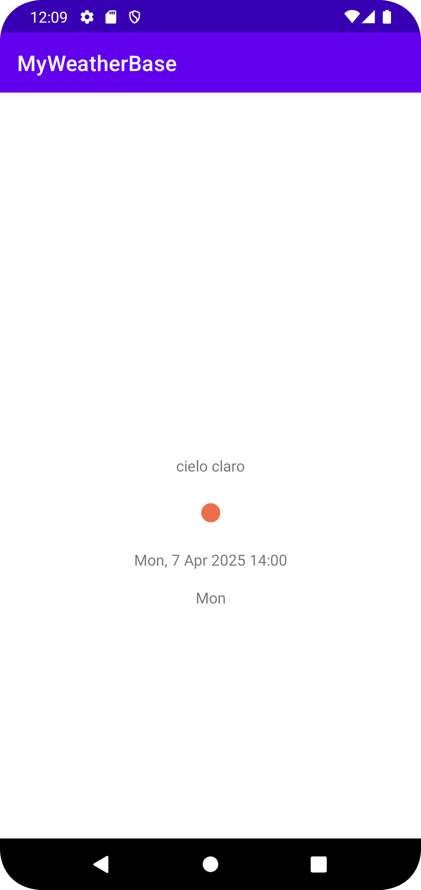

# Weather

Proyecto para realizar la actividad WeatherApp con Android. Este proyecto sirve como base para el acceso de información meteorológica de la página https://openweathermap.org/

Para que el proyecto funcione, el alumno deberá crearse una cuenta y obtener una token para la utilización de la API. 

Este token deberá incluirse en la variable API del fichero Parameters que podemos encontrar en el paquete base.

```java
public final static String API = "<put_your_API_Key_here>";
```



